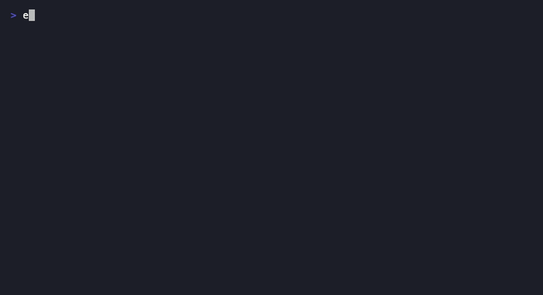
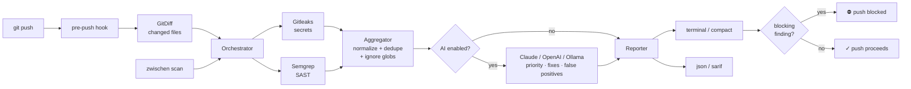

# Zwischen

[](https://github.com/cjordan223/zwischen/actions/workflows/ci.yml)
[](https://rubygems.org/gems/zwischen)
[](https://www.npmjs.com/package/zwischen)
[](https://pypi.org/project/zwischen-cli/)
[](LICENSE)



**Zwischen blocks `git push` the moment you're about to leak a secret** — the
last point where a leaked credential is still a local problem instead of an
incident. It orchestrates [Gitleaks](https://github.com/gitleaks/gitleaks)
and [Semgrep](https://semgrep.dev), normalizes their findings, and (optionally)
asks an AI provider — including fully local models via Ollama — to prioritize
the results, flag false positives, and suggest fixes.

One command sets everything up:

```bash
zwischen init   # installs gitleaks if missing, creates config, installs the pre-push hook
```

## Try it on a deliberately vulnerable app

The [zwischen-demo](https://github.com/cjordan223/zwischen-demo) repository
is a small Express app seeded with fake secrets and real vulnerability
patterns. Clone it and watch a push get blocked in under a minute.

## Installation

```bash
gem install zwischen        # canonical implementation (Ruby)
npm install -g zwischen     # Node wrapper
pip install zwischen-cli    # Python wrapper (command is still `zwischen`)
```

For local development from this repository:

```bash
bundle install
bundle exec ruby -Ilib bin/zwischen --help
```

## Quick start

Run these from the project you want to protect:

```bash
zwischen init     # config + pre-push hook + gitleaks auto-install
zwischen scan     # manual scan with full report
zwischen doctor   # check tool status
```

## AI triage

Raw scanner output tells you *what matched*. The AI pass tells you *what to
fix first and how* — see the real before/after in
[docs/triage-example.md](docs/triage-example.md), generated with a local
model via Ollama.

| Provider | Flag | Setup |
| --- | --- | --- |
| Claude | `--ai claude` | Set `ANTHROPIC_API_KEY` or pass `--api-key`. |
| Ollama | `--ai ollama` | Install Ollama and pull a model. Local-first: nothing leaves your machine. |
| OpenAI | `--ai openai` | Set `OPENAI_API_KEY` or pass `--api-key`. |

Manual scans use AI when `--ai` is passed or config enables it. Pre-push
scans stay scanner-only unless `ai.pre_push_enabled: true` — blocking
decisions should be fast and deterministic. The design rationale is in
[docs/design.md](docs/design.md).

## Commands

| Command | What it does |
| --- | --- |
| `zwischen init` | Installs/checks tools, creates config, installs pre-push hook (backs up an existing non-Zwischen hook). |
| `zwischen scan` | Runs enabled scanners, prints a terminal report. |
| `zwischen scan --changed` | Scans only files changed since the default branch. |
| `zwischen scan --only secrets,sast` | Limits to Gitleaks (`secrets`) and/or Semgrep (`sast`). |
| `zwischen scan --ai <provider>` | Adds AI prioritization, fix suggestions, false-positive detection. |
| `zwischen scan --format json` | Machine-readable summary + findings. |
| `zwischen scan --format sarif` | SARIF 2.1.0 for GitHub code scanning. |
| `zwischen scan --pre-push` | Quiet hook mode: changed files only, compact output only when blocking. |
| `zwischen doctor` | Shows Gitleaks and Semgrep status. |
| `zwischen uninstall` | Removes the hook, optionally config/credentials. |

Escape hatches: `git push --no-verify` or `ZWISCHEN_SKIP=1 git push`.

## GitHub Action

Run the same scan in CI and feed the GitHub Security tab:

```yaml
- uses: cjordan223/zwischen@main
  with:
    sarif-file: zwischen.sarif
- uses: github/codeql-action/upload-sarif@v3
  if: always()
  with:
    sarif_file: zwischen.sarif
```

## Configuration

Create or edit `.zwischen.yml` in the scanned project:

```yaml
ai:
  enabled: true
  pre_push_enabled: false
  provider: claude          # claude, ollama, or openai
  ollama:
    model: llama3
    url: http://localhost:11434
    timeout: 180            # seconds; local models can be slow to load

blocking:
  severity: high            # high, critical, or none

scanners:
  gitleaks:
    enabled: true
  semgrep:
    enabled: true
    config: p/security-audit,p/expressjs   # comma-separated rulesets

ignore:                     # findings under these globs are dropped
  - "**/node_modules/**"
  - "**/test/fixtures/**"
```

Boolean scanner entries (`gitleaks: true`) work too. Credentials are read
from environment variables first, then `~/.zwischen/credentials` (written by
`zwischen init` when `ANTHROPIC_API_KEY` is set).

## Architecture



The Ruby gem is the canonical implementation; the npm and pip packages are
convenience wrappers with a smaller command surface.

## Wrapper parity

| Capability | Ruby gem | npm / pip wrappers |
| --- | --- | --- |
| `init` / `scan` / `doctor` | ✓ | ✓ |
| `uninstall` | ✓ | — |
| `--only` scanner selection | ✓ | — |
| `--changed` / changed-file pre-push filtering | ✓ | — (hook scans the project) |
| `--format json` | ✓ | ✓ |
| `--format sarif` | ✓ | — |
| AI providers | claude, ollama, openai | ollama, openai, anthropic |

The wrapper gaps are intentional scope decisions, not bugs: the wrappers
exist so `npm install -g zwischen` / `pip install zwischen-cli` work in
ecosystems where a Ruby gem is friction, and they track the core workflow
(init → hook → scan) rather than every flag.

## Repository layout

```text
bin/zwischen                  Ruby executable
lib/zwischen/                 Ruby gem implementation
lib/zwischen/scanner/         Gitleaks and Semgrep adapters
lib/zwischen/ai/              Claude, Ollama, and OpenAI clients
lib/zwischen/reporter/        Terminal and SARIF reporters
packages/npm/                 Node wrapper package
packages/pip/                 Python wrapper package
spec/                         RSpec suite
action.yml                    Composite GitHub Action
docs/                         Design write-up, triage example, demo GIF
```

## Development

```bash
bundle exec rspec             # 196+ examples
./scripts/test_as_gem.sh      # install and exercise as a real gem
```

See [DEVELOPMENT.md](DEVELOPMENT.md) for architecture notes and the release
process, and [TESTING.md](TESTING.md) for the end-to-end test plan.

## License

MIT
